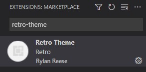

# retro-theme README

Retro Theme is a short mini project I worked on to create a new theme for Microsoft VS Code
Feel free to make changes and submit them!

Enjoy!

This theme can be found by going to -> "Extensions" then typing "retro-theme".

The following image below is a preview of the color theme.

